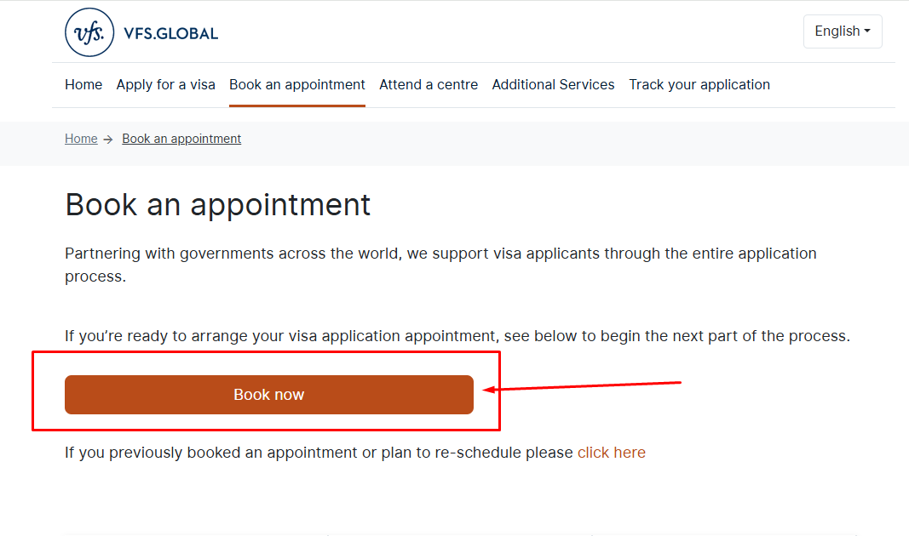
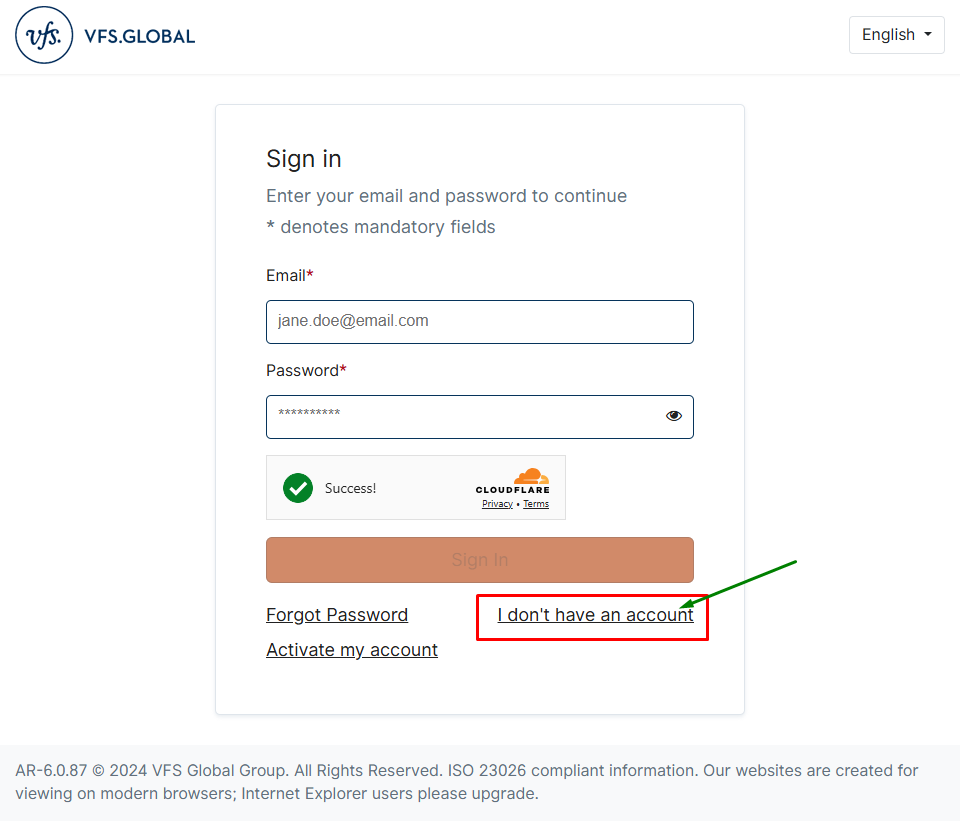
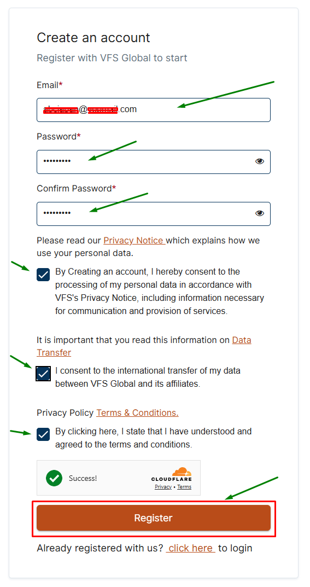
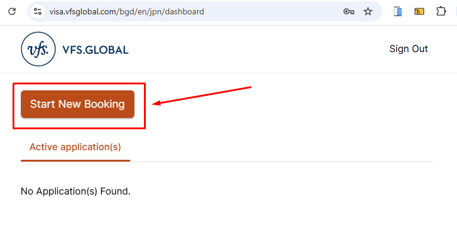

⬅️ [Back to Main Menu](../README.md#contents)

# ✈ Japan Visa Application Guide

Application for Japan visa after 3rd November, 2024 is currently available through VFS Global.
The Embassy of Japan will no longer accept visa applications after 3rd November, 2024.

This guide provides a step-by-step process for applying for a Japan visa through the official VFS Global website: [Visa VFS Global - Japan](https://visa.vfsglobal.com/bgd/en/jpn/apply-visa).

---

## Table of Contents

- [Overview](#overview)
- [Step 1: Determine Visa Type](#step-1-determine-visa-type)
- [Step 2: Prepare Required Documents](#step-2-prepare-required-documents)
- [Step 3: Create an Account on VFS Global](#step-3-create-an-account-on-vfs-global)
- [Step 4: Complete the Visa Application Form](#step-4-complete-the-visa-application-form)
- [Step 5: Book an Appointment](#step-5-book-an-appointment)
- [Step 6: Visit the Visa Application Center](#step-6-visit-the-visa-application-center)
- [Step 7: Track Your Application](#step-7-track-your-application)
- [Step 8: Collect Your Passport](#step-8-collect-your-passport)
- [Additional Information](#additional-information)

---

## Overview

Applying for a Japan visa involves several steps, including determining your visa type, preparing necessary documents, submitting your application, and attending an appointment. Follow this guide for a smooth application process.

---

## Step 1: Determine Visa Type

Visit the [Visa Types](https://visa.vfsglobal.com/bgd/en/jpn/apply-visa) page to check which visa category fits your purpose of travel:

- **Tourist Visa:** For sightseeing, leisure, or visiting family.
- **Business Visa:** For business meetings, conferences, or professional engagements.
- **Student Visa:** For studying in Japan.
- **Work Visa:** For employment in Japan.
- **Dependent Visa:** For family members or dependents.

> Required documents may vary depending on the selected visa type.

---

## Step 2: Prepare Required Documents

Gather the following standard documents:

- **Valid Passport:** Must be valid for at least six months.
- **Visa Application Form:** Fully completed and signed.
- **Passport-Sized Photos:** Recent, as per specifications.
- **Travel Itinerary:** Flight and accommodation details.
- **Proof of Financial Means:** Bank statements, salary slips, or sponsorship letters.
- **Supporting Documents:** As per visa type (invitation letters, proof of employment, etc.).

> Additional documents may be required for specific visa types. Detailed informations are written on the related page for each visa type. Check [here](../README.md#L9) for details.

---

## Step 3: Create an Account on VFS Global

1. Visit VFS Global - Japan website & [Book an Appointment](https://visa.vfsglobal.com/bgd/en/jpn/book-an-appointment).
   
2. Click **Sign Up** and create an account if you are visiting for the first time.
   
   
3. Verify your email address and log in.
4. When logging in for the first time, you will be asked to set up your mobile number. Input your phone number where they can reach you anytime they need to contact you.

---

## Step 4: Complete the Visa Application Form

1. Download and fill out the [Visa Application Form](https://assets.ctfassets.net/xxg4p8gt3sg6/1tZMpqoj1iQmtC6NDmqzjF/6c6cd504630f949b7edb3281f2a8ab81/Application-Form.pdf).
2. Double-check all information and submit the form.
3. Print and sign the application form.
4. Or you can print the blank application form and fill it out by hand.

---

## Step 5: Book an Appointment

1. After filling out the form, Log into your VFS Global account using your email and password you entered during account creation on [step 3](#step-3-create-an-account-on-vfs-global).
2. Click on the **Start New Booking** button on the homepage.
   
3. Fill out the online application form carefully with necessary documents they require.
4. Double-check all information and submit the form.
5. After submitting the form, You’ll receive an appointment confirmation email along with the letter of appointment.

---

## Step 6: Visit the Visa Application Center

1. Arrive at the Visa Application Center on the scheduled date.
2. Bring all required documents, including your appointment confirmation.
3. Submit your application and provide biometric data (if required).
4. Pay the visa application fee.

---

## Step 7: Track Your Application

1. Visit the [Track Application](https://www.vfsvisaonline.com/Global-Passporttracking/Track/Index?q=shSA0YnE4pLF9Xzwon/x/MzqzJ82s//rbrz+v8x7NQYuOEBALzHuTQfviG5JLrOny1yertdGGYTuHVPtieK+SrPADBEQDM6mbSmwu93hAAg=) page.
2. Enter your reference number and date of birth.
3. Monitor the status of your application.

---

## Step 8: Collect Your Passport

1. Once your visa is processed, you will be notified.
2. Collect your passport from the Visa Application Center or request courier delivery if available.

---

## Additional Information

- **Processing Time:** Check the official website for the estimated processing time for your visa type. Recently, the processing time for visas has been increased.
- **Visa Fees:** Fees vary based on the type of visa and service selected (Free from Bangladesh).
- **Customer Support:** For inquiries, visit the [Contact Us](https://visa.vfsglobal.com/bgd/en/jpn/contact-us) page.
- **Contact Information:**

  | Title  | Description                                                                         |
  | :----- | :---------------------------------------------------------------------------------- |
  | Addres | Delta Life Tower, 4th Floor, Road#90, Plot # 37, Gulshan-2, Dhaka-1212, Bangladesh. |
  | Tel    | 09606 777 910                                                                       |
  | E-mail | [info.japanbd@vfshelpline.com](mailto:info.japanbd@vfshelpline.com)                 |
  | URL    | [https://visa.vfsglobal.com/bgd/en/jpn](https://visa.vfsglobal.com/bgd/en/jpn)      |

---

**Disclaimer:** This guide is for informational purposes only. Refer to the official [VFS Global - Japan](https://visa.vfsglobal.com/bgd/en/jpn/apply-visa) website for the most accurate and updated information.

[⬆ Back to top](#table-of-contentsii)
