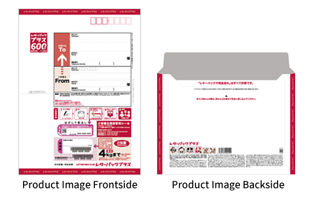

⬅️ [Back to Main Menu](../README.md#contents)

# 🌏 Step-by-Step Guide to Re-issue Your Bangladeshi Passport in Japan

If you're living in Japan and need to re-issue your Bangladeshi passport, you can do so either by visiting the embassy in person or by applying through the post. This guide details both methods for your convenience. Access the official forms and updates on the **Bangladesh Embassy, Tokyo website** [here](http://bdembjp.mofa.gov.bd/consular-service).

---

## Prerequisites

You will have two options for applying a passport reissue.

- [Apply by Visiting the Embassy](#-option-1-apply-by-visiting-the-embassy)
- [Apply by Post](#-option-2-apply-by-post)

### 🏢 Option 1: Apply by Visiting the Embassy

Before heading to the embassy, ensure you have the following documents:

- Existing passport(s).
- Photocopy of existing passport (2nd & 3rd page)
- Residence Card photocopy.
- Photocopy of NID/Birth Certificate (according to personal identification number on passport)
- Student Enrollment Certificate main copy & student ID photocopy (_Only for Students_)
- Personal informations on a blank paper
- Recent passport-size photographs.
- Completed application form (downloadable from the embassy website).
- Bank receipt as proof of the fee payment.

### 📮 Option 2: Apply by Post

For postal applications, gather these additional items:

- All documents listed in the "[Apply by Visiting the Embassy](#-option-1-apply-by-visiting-the-embassy)" section.
- A **self-addressed return envelope** with the correct postage for sending your passport back.
- Declaration Form (Described below)

---

## Steps to Apply

1. **Collect Required Documents:**  
   Gather all the documents listed above. Double-check that all details are correct to avoid delays.

   - Main copy of your existing passport.
   - Include a photocopy of your passport. Only include the 2nd and 3rd pages of your passport where the personal information is printed.
   - Include a photocopy of your residence card (both front and back sides).
   - Include a photocopy of your NID/Birth Certificate. Check your personal identification number on your passport. If the personal identification number on your passport is from NID, include a photocopy of your NID. If the personal identification number on your passport is from Birth Certificate, include a photocopy of your Birth Certificate. In my case, the personal identification number on my passport is from Birth Certificate, so I included only a photocopy of my Birth Certificate with the application form.
   - Include an original copy of your student enrollment certificate (Only if you are a student).
   - Include a photocopy of your student ID (Only if you are a student).
   - Write your personal information on a blank paper and include it with the application form. Don't forget to sign it. It will look like the example below:

     

     you can also find this file in the [resources folder](../resources/files/personal-info.docx) and download it.

   - When applying through the post, include a self-addressed return envelope with the correct postage. Don't forget to fill in the addresses on the back of the envelope. You can buy this red bordered `Letter Pack Plus` envelope at any convenience store(e.g. 7-Eleven, Lawson, etc). It will cost you 600 yen. Show the below envelope image at the convenience store or ask the staff for red bordered envelop.

     

     Buy two envelopes at once because you have to send your passport & application using the same envelope. Fill in the addresses on the back of the envelope of the return envelope and put it with the application form. Its totally fine to do a single fold of the return elvelope.

   - When applying through the post, include a Declaration statement form with the application where you declare that embassy is not responsible for any damage or loss to your passport while sending it by post. Don't forget to sign it. It will look like the example below:

     

     you can also find this file in the [resources folder](../resources/files/declaration-statement.docx) and download it.

2. **Fill Out the Application Form:**

   - Download the form from the [Consular Service Section](http://www.passport.gov.bd/Reports/MRP_Information_Alteration_Correction.pdf).
   - Fill in all fields accurately, including your _name, passport number, place of issue, date of issue, date of expiry and current address_.
   - If there are any correction to your personal information is needed, include the required information on the **Expected Correction** section. Write the existing information on the left side of this section ( _Information on existing passport_ ) & expected change on the right side ( _Expected Change/Correction_ ).
   - If you dont have any correction to your personal information, just write your present japanese address on the bottom right side of the **Expected Correction** section (under the _Expected Change/Correction_ portion).
   - Attach a passport-size photo at the top left corner of the form.

   A sample application form is given below.

   

   > Note: In the above form, I assume that there is no correction to personal information.

3. **Pay the Application Fee:**

   - Bank Transfer(`振込 => furikomi`) the required amount to their designated bank. Bank transfer fee need to be paid by the sender.
   - Application fee for each passport is `JPY 18,000` yen.
   - If you are a student, the fee will be `JPY 6,000` yen. Obviously you have to submit the recently issued main copy of student enrollment certificate & photocopy of student ID along with the application form.
   - You can transfer money online through the internet & ask for a transfer certificate from your bank(if they provide this service) or by visiting a designated bank.
   - Collect the receipt or stamp as proof of payment. In easy words, you need a money transfer document that contains stamp(`印鑑 =>inkan`) from the sender's bank.
   - Make a photocopy of the furikomi receipt and keep it to yourself.
   - Obtain a receipt or stamp as proof of payment.
   - Bank details for payment:
     | Title | Description |
     |:----------|:----------|
     | Account Name | Embassy of Bangladesh Tokyo Consular |
     | Bank Name | Mitsubishi UFJ Bank (MUFJ) |
     | Branch Name | Kojimachi(Code: 616) |
     | Type of Account | Ordinary Bank Account (`普通 => Futsuu`) |
     | Account No. | 0393471 |
     > **⚠ Warning**: Confirm the bank details with the embassy website [here](http://bdembjp.mofa.gov.bd/consular-service) before transferring.

   **Tips**: I went physically to the Miyazaki Bank and asked for a Bank Transfer(`振込 => furikomi`) to other bank; I paid 18,000 yen in cash at the counter along with the transfer fee of 660 yen.
   I was provided with a Bank Transfer certificate(`振込証明書 => furikomi shoumei-sho`) from the Miyazaki Bank which i attached to the application form.
   It took me 12-15 minutes to complete the whole process.

4. **Submit the Application:**

   As we've discussed earlier, you can either visit the embassy in person or apply through the post.
   Now that we have all the necessary documents, it's time to submit the application.

   - **Apply by Visiting the Embassy**:

     - Take all your documents to the Bangladesh Embassy in Tokyo.
     - Submit your application at the **Consular Section**.
     - Embassy Address:
       ```
       Embassy of Bangladesh, Tokyo
       〒102-0094
       3-29, Kioicho, Chiyoda-ku Tokyo
       Telephone:  +813 3234 5801
       ```
       In japanese:
       ```
       Embassy of Bangladesh
       〒102-0094, 東京都千代田区紀尾井町3-29
       電話番号: +813 3234 5801
       ```

   - **Apply by Post**:
     - Package all documents securely.
     - dont forget to add the declaration form & return envelope to the package.
     - dont forget to fill in the return envelope with your address.
     - Embassy address is the same as above.
     - Keep a photo of the the envelopes for tracking purpose.
     - You can track your envelopes from [here](https://www.post.japanpost.jp/index_en.html).

   > **⚠ Important Note !!** : Those who applied through the post, they will receive a delivery slip on their email address within a month after submission. You have to check your email for the confirmation letter.
   > After receiving the delivery slip, print it and write the current passport number & signature on it. After that, reply back to the email with a softcopy of the signed delivery slip.
   > If you apply by visiting the embassy, you can sign the delivery slip on the same day.

5. **Track and Collect Your Passport:**
   - Track your passport using the delivery slip number.
   - You can check your passport printing status from [here](http://passport.gov.bd/onlinestatus.aspx) using the delivery slip number.

---

If you follow the above steps correctly, you can be sure to receive a new passport within 20 days to 2 months.
Depending on the situation, it may take longer or shorter.

If you applied through the post, you will receive your new passport at your home address.

If you applied by visiting the embassy, embassy will inform you to collect your passport from the embassy.

> In my case, I applied by the post. I received my new passport at my home address within two and a half months.

## 🛠️ Tips for Both Methods

- **Double-check documents:** Incomplete applications can delay processing.
- **Plan ahead:** Start the process early, especially if your passport is nearing expiry.
- **Stay updated:** Regularly check the embassy's website for updates or changes.

---

**Note**: The above information is based on my experience and information gathered from other applicants.

[⬆ Back to top](#-step-by-step-guide-to-re-issue-your-bangladeshi-passport-in-japan)
