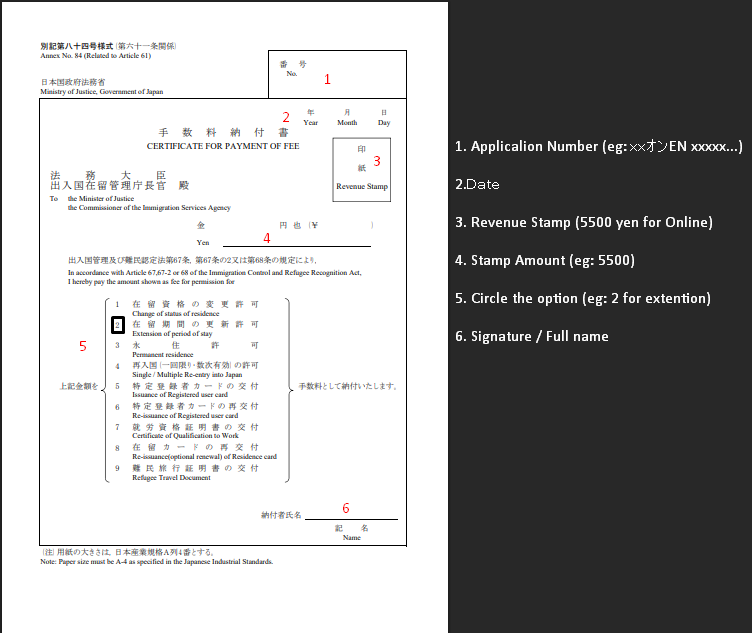

⬅️ [Back to Main Menu](../README.md#contents)

# 💻 The Complete Online Residence Card Renewal Guide

This guide provides a comprehensive step-by-step process for renewing your Japanese Residence Card (`在留カード => zairyu kaado`) through the Immigration Services Agency (ISA) online system. This method allows you to complete the application from home and receive your new card by mail, avoiding long queues at the immigration office.

This document covers everything from system setup, downloading and completing the official forms, preparing supporting documents, merging all files into a single PDF, and submitting via the online portal.

## Table of Contents

- [Prerequisites: What You Need](#-prerequisites-what-you-need)
- [Step 1: System Setup (PC & Software)](#-step-1-system-setup-pc--software)
- [Step 2: Registering Your Account](#-step-2-registering-your-account)
- [Step 3: Download & Complete the Application Forms](#-step-3-download--complete-the-application-forms)
- [Step 4: Prepare Supporting Documents](#-step-4-prepare-supporting-documents)
- [Step 5: Merge & Compress All Files into One PDF](#-step-5-merge--compress-all-files-into-one-pdf)
- [Step 6: Submit via the Online Portal](#-step-6-submit-via-the-online-portal)
- [Step 7: After Approval - Receiving the "Notice of Completion"](#-step-7-after-approval---receiving-the-notice-of-completion)
- [Step 8: Mailing Your Documents to Immigration](#-step-8-mailing-your-documents-to-immigration)
- [Step 9: Receiving Your New Residence Card](#-step-9-receiving-your-new-residence-card)
- [💡 Tips & Tricks](#-tips--tricks)
- [⚠ Important Warnings](#-important-warnings)
- [🔗 Resources](#-resources)

---

## 📋 Prerequisites: What You Need

Before you begin, ensure you have the following items:

- **MyNumber Card (`マイナンバーカード => mai nanbaa kaado`):** Your physical card, not just the notification paper.
- **MyNumber Card Passwords:** You will need the 4-digit PIN and, most importantly, the 6-16 digit digital certificate password.
- **IC Card Reader (`ICカードリーダー => IC kaado riidaa`):** A USB device to read your MyNumber Card. **This is the highly recommended method.**
- **OR NFC-Enabled Smartphone:** A smartphone that can read the chip in your MyNumber Card.
  > **Note:** While this is an option, many users (including the author of this tip) report that it is difficult to get working. Save yourself the trouble and get a card reader.
- **A PC or Smartphone:** To access the application website.

---

## 🖥 Step 1: System Setup (PC & Software)

Before you can register, you must install the "JPKI" software, which allows the website to read your MyNumber Card.

### 1. Set Up Your IC Card Reader (Recommended Method)

1. **Purchase a Reader:** Buy a MyNumber Card compatible IC Card Reader. They are available on Amazon Japan, Rakuten, or at electronics stores like Yodobashi Camera or Bic Camera.
2. **Plug It In:** Connect the reader to your PC's USB port.

### 2. Install Required Software & Extensions

1. **JPKI Client Software:** This is the main software "driver."

   - **Go to the official JPKI Download Page:** [https://www.jpki.go.jp/download/index.html](https://www.jpki.go.jp/download/index.html)
   - **For PC (Windows/Mac):** Download and install the "JPKI Client Software" (`利用者クライアントソフト`).

2. **Browser Extension/Add-on (JPKI Bridge):**

   - The JPKI Client Software needs a "bridge" to communicate with your browser (Chrome, Edge, Firefox).
   - The client software installer will not prompt you to install this automatically.
   - Download and install the extension [here](https://chromewebstore.google.com/detail/%E5%88%A9%E7%94%A8%E8%80%85%E3%82%AF%E3%83%A9%E3%82%A4%E3%82%A2%E3%83%B3%E3%83%88%E3%82%BD%E3%83%95%E3%83%88-edgechrome/ddhaancdmkmeigppopkakhpbboccibla)

3. **Potential Java Requirement:**

   - Some users report needing **Java Runtime Environment 8.0**.
   - You can download it from the official Java website (search for "Java 8 download").
   - After installation, you can confirm it's recognized by checking for "Java" in your Windows Control Panel.

4. **For Non-Japanese Windows Users (!! IMPORTANT !!):**

   - The JPKI software may display garbled text (`文字化け => mojibake`) if your system's default language is not Japanese.
   - To fix this, you will need **Locale Emulator**.
   - **Download Locale Emulator:** [https://xupefei.github.io/Locale-Emulator/](https://xupefei.github.io/Locale-Emulator/)
   - After installing it, you must run the JPKI client software (and possibly your browser) by right-clicking and selecting "Run in Japanese" from the Locale Emulator menu.

5. **Run the JPKI Self-Test (!! CRITICAL !!):**
   - After installing all the above, run the JPKI Client Software.
   - It has a "Self-Test" (`自己診断`) or "Show Certificate" (`証明書を表示`) button.
   - Place your MyNumber Card on the reader and enter your password.
   - This test will confirm if:
     1. The reader is working.
     2. The software is installed.
     3. **The browser extension/bridge is working.**
   - **Do not proceed to Step 2 until this test passes.**

---

## 🔑 Step 2: Registering Your Account

Once your setup is working, you can create your account on the ISA system.

1. **Go to the ISA Online System:** [https://www.ras-immi.moj.go.jp/WC01/WCAAS010/](https://www.ras-immi.moj.go.jp/WC01/WCAAS010/)
2. **Start New Registration:** Click the button for "New User Registration" (`利用者情報登録`).
3. **Use a .jp Email Address:**
   - It is **highly recommended** to use a Japanese email address. Some users report issues with foreign email providers.
   - You can get a free `@yahoo.co.jp` address. After registration, you can set it to forward emails to your primary account.
4. **Agree to Terms:** Read and agree to the terms of service.
5. **Authenticate:** The site will now ask you to authenticate.
   - **!! PASSWORD WARNING !!:** You will need your 6-16 digit digital certificate password. This password is very likely **ALL-UPPERCASE**, even if you remember setting it as lowercase or mixed-case.
   - Try the **all-uppercase** version of your password first.
   - If you fail 5 times, your card will be **locked**, and you must visit your city office to unlock it. Be very careful.
6. **Create Account:** Once authenticated, you will be asked to create a User ID and Password for the site.
7. **Confirmation:** You will receive a confirmation email. Your account is now ready.

---

## 📝 Step 3: Download & Complete the Application Forms

This is the most important part of the preparation. You **must** download the official application forms, fill them out, print, sign, and scan them.

### 1. Download the Official Forms

Go to the ISA's official forms page to get the correct files for your visa type.

- **ISA Application Forms List (Main Page):** [https://www.moj.go.jp/isa/applications/procedures/16-3.html](https://www.moj.go.jp/isa/applications/procedures/16-3.html)
- **Direct Links (Form No. 30-2):**
  - **Excel (`.xlsx`) format:** [https://www.moj.go.jp/isa/content/930004121.xlsx](https://www.moj.go.jp/isa/content/930004121.xlsx)
  - **PDF (`.pdf`) format:** [https://www.moj.go.jp/isa/content/930004094.pdf](https://www.moj.go.jp/isa/content/930004094.pdf)
- **Important:** You must download all the parts for your visa type. This includes "For Applicant" (`申請人用`) and "For Organization" (`所属機関等作成用`).

### 2. Fill and Sign the Forms

1. **Fill Electronically:** Use the Excel version to type all your information. It is much cleaner and more professional than handwriting.
2. **Get Organization Part Filled:** Send the "For Organization" (`所属機関等作成用`) forms to your company's HR or school's administration office. Give them at least one or two weeks to complete it.
3. **Print and Sign:** Once all forms (both your part and the organization's part) are complete, print them.
4. **Physically Sign:** Go to the designated signature box on the "For Applicant" form and **physically sign** it with a pen.
5. **Scan:** Scan the completed and signed paper forms to PDF.

### Tips for Filling Forms

- **Write Your Name EXACTLY as it Appears on Your Residence Card:** This is a critical check. Look at your current residence card. Your name must be written in the exact same order and case.
  - _Example:_ On the application, write `CHOWDHURY ISHMAM ABIR` (all uppercase, family name first) if that is what is printed on your card. Do not write "Ishmam Abir Chowdhury".
- **Consistency is Key:** Your name, passport number, and residence card number must be _exactly_ the same across all documents.
- **Proofread:** Double-check everything. Ask a Japanese-speaking friend or colleague to review the forms for any simple mistakes.

---

## 📄 Step 4: Prepare Supporting Documents

In addition to the main application form, you must gather and scan all other supporting documents. The required documents depend on your visa type.

### 1. For "Engineer/Specialist in Humanities/Int'l Services" Visa (and other work visas)

This is the most important step for work visas. The documents you need depend on your company's "Category" (`カテゴリ`). **You must ask your company's HR which category it is.**

- **Category 1 (`カテゴリ１`):** Publicly listed companies, government organizations, etc.
- **Category 2 (`カテゴリ２`):** Organizations that paid over 10 million JPY in withholding tax last year or fullfills other conditions.
- **Category 3 (`カテゴリ３`):** Organizations that paid less than 10 million JPY in withholding tax last year.
- **Category 4 (`カテゴリ４`):** New companies or organizations with no withholding tax record or companies that doesn't fit on above categories.

**Source:** You can see these categories on the official ISA page for the "Engineer" visa and confirm which document is needed for your company's category: [https://www.moj.go.jp/isa/applications/status/gijinkoku.html](https://www.moj.go.jp/isa/applications/status/gijinkoku.html)

> **Document Checklist** [Here](https://www.moj.go.jp/isa/content/001367009.pdf)

### 2. Documents for All Applicants

You will almost always need to provide these, regardless of your visa type:

1. **Tax & Income Certificates (`課税・納税証明書 => kazei/nouzei shoumeisho`):**

   - **Source:** Your local City/Ward Office (`市役所・区役所 => shiyakusho/kuyakusho`).
   - **How to get:** The fastest way is to use your MyNumber Card at a multi-copy machine in any major convenience store (`コンビニ => conbini`) to print them.
   - You need the **most recent** certificates showing your total income and that your residence tax is paid.

2. **Scans of Residence Card & Passport:**

   - Scan your Residence Card (front and back).
   - Scan your Passport (the photo/information page).

3. **Digital ID Photo (`証明写真 => shoumei shashin`):**
   - A recent, passport-style digital photo (plain background, facing forward). This is usually uploaded as a separate file, not part of the main PDF.

---

## 🧬 Step 5: Merge & Compress All Files into One PDF

The online portal has a strict file size limit (often 10MB total). You must merge all your scanned files from **Step 3** and **Step 4** into a _single PDF file_.

> **⚠ Privacy Note:** You will be uploading highly sensitive documents. While free online tools are widely used and secure, you are using them at your own discretion.

### Step-by-Step: Using iLovePDF

1. **Gather Your Files:** Collect all your scanned PDFs:
   - The completed and signed Application Forms (from Step 3)
   - All Supporting Documents (from Step 4, _except_ the ID photo)
2. **Go to iLovePDF:** [https://www.ilovepdf.com](https://www.ilovepdf.com)
3. **Merge PDF:**
   - Select the **"Merge PDF"** tool.
   - Upload all your individual files.
   - Drag and drop them into a logical order (e.g., Application, Passport, Residence Card, Company Docs, Tax Certs).
   - Click **"Merge PDF"** and download the combined file.
4. **Compress PDF:**
   - Check the file size. If it's over 10MB, go back to the iLovePDF homepage.
   - Select the **"Compress PDF"** tool.
   - Upload the large merged file.
   - Choose **"Recommended compression"** (this is usually enough).
   - Click **"Compress PDF"** and download your final, small file. **This is the file you will upload.**

---

## 📤 Step 6: Submit via the Online Portal

Now you use the online system to submit your application.

1. **Log In:** Go to the [ISA Online System](https://www.ras-immi.moj.go.jp/WC01/WCAAS010/) and log in.
2. **Start Application:** Find and select the "Application for Extension of Period of Stay" (`在留期間更新許可申請 => Zairyū kikan kōshin kyoka shinsei`).
3. **Complete the Web Form:** The portal will ask you to fill in _basic_ information (like your name, residence card number, etc.). This is _in addition_ to the forms you already filled out.
4. **!! CRITICAL: Check Files Before Uploading !!**
   - The online system **does not allow you to delete or replace a file** once you have uploaded it.
   - Before proceeding, **TRIPLE-CHECK** that your digital ID photo is correct and that your merged PDF contains all the correct, signed, and clearly scanned documents.
5. **Upload Your Files:** The system will prompt you to upload:
   - Your Digital ID Photo (from Step 4)
   - Your single, merged, compressed PDF (from Step 5)
6. **Click the Final "Submit" Button:**
   - After all files are uploaded, you **must** click the final "Submit" (`申請`) button.
   - Your application **will not proceed** just by uploading the files. You must confirm the submission. You should receive a confirmation email and a receipt number (`申請受付番号 => Shinsei uketsuke bangō`) almost immediately.
7. **Wait for Review:** After submission, your application status will be "under review." This process can take several weeks to a few months.

---

## ✅ Step 7: After Approval - Receiving the "Notice of Completion"

You will eventually receive an automated email from the immigration system (`在留申請オンラインシステム`) stating that your application review is complete (`審査が完了しました`).

This email is _not_ the final approval. It is the notification that it's time to complete the final step: mailing your documents to get the new card printed. The email will list the _exact_ documents you need to send.

---

## 📮 Step 8: Mailing Your Documents to Immigration

Once you receive the approval email, you must mail the following items to the address specified in the email (typically within 14 days).

> **Note:** The address below is an _example_ from the email you provided. **You must send your documents to the address in YOUR email.**
>
> ```text
> 〒135-0064
> 東京都江東区青海2-7-11 東京港湾合同庁舎 9階
> 東京出入国在留管理局オンライン審査部門オンライン申請手続班（おだいば分室内）
> ```

Here is what you need to send:

1. **Return Envelope (`返信用封筒 => henshinyou fuutou`):**

   - The easiest option is a **Letter Pack Plus (`レターパックプラス => retaapakku purasu`)**, which you can buy at any convenience store. Write your own name and address in the "To" field.
   - Write your Application Receipt Number (`申請受付番号`) from the email on the _back_ of the return envelope.

2. **Payment Form (`手数料納付書 => tesuuryou noufusho`):**

   - Download the form [here (PDF)](http://www.moj.go.jp/isa/content/930002833.pdf).
   - Buy a **Revenue Stamp (`収入印紙 => shuunyuu inshi`)** for the required amount (e.g., ¥5,500 as specified in your email).
   - Stick the revenue stamp onto the payment form.
   - Fill in your Application Receipt Number (`申請受付番号`) and your Name (`氏名`) on the form.

   

3. **Your Current Residence Card (`在留カード => zairyu kaado`):**

   - Yes, you must send the **original** card.
   - **!! IMPORTANT !!:** Before you mail it, **make a high-quality color copy (front and back)**.
   - On the _back_ of the copy, write the information from your email:

     ```text
     申請受付日：<Your Application Date, e.g., 2025年10月7日>
     申請受付番号：<Your Receipt Number, e.g., 福オンＥＮ25001878>
     ```

   - You **must** carry this copy and your passport with you at all times as proof of your status until your new card arrives.

4. **Designation Paper (`指定書 => shiteisho`) (If applicable):**
   - If your visa status is "Highly-Skilled Professional," "Specified Skilled Worker," or "Designated Activities," send this paper.
   - **DO NOT send your passport.**

---

## 📬 Step 9: Receiving Your New Residence Card

After you mail the documents, all you have to do is wait.

- You can track your outgoing Letter Pack to see when it arrives at the immigration office.
- Within a week or two, your new Residence Card will arrive at your home in the return envelope you provided.
- They will also return your old card, which will have a hole punched in it to show it is invalid.

> **Note**: Update your new recidence status in your bank account, MyNumber Card & other documents after receiving your new residence card.

---

## 💡 Tips & Tricks

- **Save Your Progress:** The online system can time out. Save your application as a draft (`一時保存`) frequently.
- **Apply Early:** The system allows you to apply 3 months before your card expires. Do it as soon as possible.
- **Use Convenience Stores:** Getting your tax certificates (`課税・納税証明書`) from a convenience store using your MyNumber Card is the fastest and easiest way.
- **Letter Pack Plus:** Use the red `Letter Pack Plus` (¥600) for mailing your card. It's tracked and requires a signature, giving you peace of mind. Alternatively, you can also use `Letter Pack Light` or `Envelope with Stamps` but those can't be tracked.
- **Digital Photo:** You can take a high-quality photo with your smartphone against a plain white wall. Crop it to the correct aspect ratio, and it's usually accepted.
- **Adobe Scan:** A free mobile app for your phone (iOS/Android). It's excellent for scanning documents clearly and saving them directly as a PDF.

---

## ⚠ Important Warnings

- **File Uploads are Final (!! CRITICAL !!)**

  - The online system **does not allow you to delete or re-upload** files. If you upload the wrong photo or the wrong PDF, you cannot fix it. You must be 100% sure your files are correct _before_ you upload them in Step 6.

- **MyNumber Card Password (!! CRITICAL !!)**

  - The 6-16 digit digital certificate password (the one used for authentication) is often **all-uppercase**.
  - Many users have locked their cards by repeatedly trying a lowercase or mixed-case password.
  - Before you start, try to recall if your password was all caps. If you fail 5 times, your card will be **locked**, and you **must** go to your city/ward office in person to reset it.

- **Do Not Miss the Deadline:** You must complete this mail-in process and receive your new card. If you let your current card expire and 2 months pass, you could lose your residency status.

- **No "Minashi" Re-entry:** While your old residence card is in the mail, you **cannot** leave and re-enter Japan using the Special Re-entry Permit (`みなし再入国許可 => minashi sai'nyuukoku kyoka`). If you have an emergency and must leave Japan, you must go to your local immigration office in person to apply for a standard re-entry permit _before_ you mail your card.

- **Report Changes:** If your situation changes _after_ you applied (e.g., you lost or quit your job), you must contact the immigration office immediately. Receiving a new card based on old information can lead to your visa being revoked.

---

## 🔗 Resources

- **ISA Online System Login:** [https://www.ras-immi.moj.go.jp/WC01/WCAAS010/](https://www.ras-immi.moj.go.jp/WC01/WCAAS010/)
- **ISA Page (Extension of Stay Procedures):** [https://www.moj.go.jp/isa/applications/procedures/16-3.html](https://www.moj.go.jp/isa/applications/procedures/16-3.html)
- **ISA Page (Engineer/Specialist in Humanities Visa Docs):** [https://www.moj.go.jp/isa/applications/status/gijinkoku.html](https://www.moj.go.jp/isa/applications/status/gijinkoku.html)
- **ISA Application Forms List (Excel/PDF):** [https://www.moj.go.jp/isa/applications/procedures/index.html](https://www.moj.go.jp/isa/applications/procedures/index.html)
- **JPKI Software Download Page:** [https://www.jpki.go.jp/download/index.html](https://www.jpki.go.jp/download/index.html)
- **Locale Emulator Download:** [https://xupefei.github.io/Locale-Emulator/](https://xupefei.github.io/Locale-Emulator/)
- **Fee Payment Form (Tesuuryou Noufusho):** [http://www.moj.go.jp/isa/content/930002833.pdf](http://www.moj.go.jp/isa/content/930002833.pdf)
- **User Guide (Reddit):** [Online Visa Renewal Tips and Advice](https://www.reddit.com/r/japanlife/comments/1ado4ha/online_visa_renewal_tips_and_advice/)
- **Video Walkthrough:** - [https://youtu.be/yj8WClGGxRM](https://youtu.be/yj8WClGGxRM) - [Application Form Fillup Guide](https://youtu.be/OyMgITcsEXQ?si=y7myQnt2Mu7t3-tL) - [Online Submission Guide](https://www.youtube.com/watch?v=g9lajFRnAD4)
- **PDF Tools (External):** [iLovePDF](https://www.ilovepdf.com), [Smallpdf](https://www.smallpdf.com)

---

**[⬆ back to top](#table-of-contents)**
